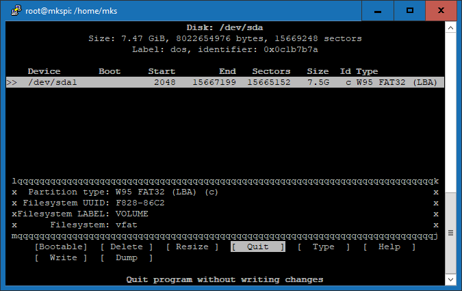
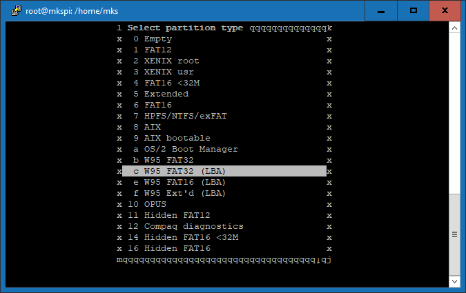
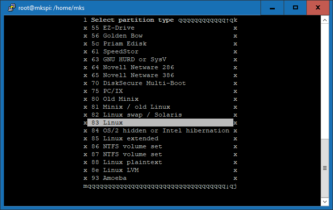
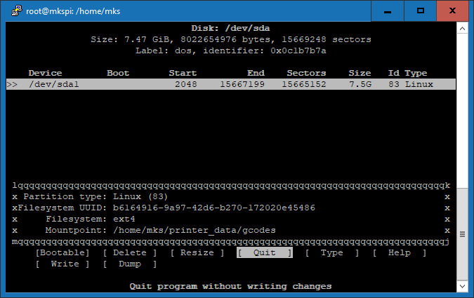

# Expand G-Code storage space
{: .no_toc }
### Contents:
{: .no_toc }
- TOC
{:toc}
----

Experienced Linux users: Scroll down to [For the linux gurus](#for-the-linux-gurus) for a short sum-up what is required.

----

Sovol's KlipperScreen uses an 8GB emmc card for storage, of which about 7GB are used by the system.

If the empty space gets completely used up by gcode files, it will lead to problems, e.g. the PowerLossResume can cause a boot loop, because it cannot update its state file (saved_variables.cfg).

This can be prevented by using a usb-drive to store the gcode files to.

There is an automount script, which automatically detects inserted usb-drives and mounts them to `~/printer_data/gcodes/USB`, but it does not automatically store the gcode files there.

Sadly, it is not an easy task getting the system to just use this "USB" subdirectory, it would require changing several config files (printer.cfg, mainsail.cfg, fluidd.cfg and the moonraker sources).

But it is possible to mount the usb-drive directly to `~/printer_data/gcodes`. This way the gcode files will be written to the usb-drive, but to Klipper it looks like the usual directory. So none of Klipper's config files have to be changed, no matter if the drive is inserted or not.


## Requirements
  * The usb-drive has to be formatted as linux-ext filesystem (it has to support linux-style access rights), otherwise it will give errors when uploading gcodes.
  * Preparing the partition and formatting ext is not possible on Windows, that has to be done from linux (it can be done from within the KlipperScreen).
  * When inserting/partitioning/formatting the disk, the automounter will mount it to `~/printer_data/gcodes`, so we will have to unmount it before each step.
  * When the usb-drive is not inserted, the system should boot up normally (by default it would wait very long at boot and raise an error afterwards). That can be achieved by mount options in the fstab.
  * To do all these steps, you have to log into the device by using ssh/putty.

----

{: .warning }
> **Beware: If all that sounds very gibberish to you and you are a complete linux novice, then it might be better to just leave the system as-is and just clean up the old gcode files manually.**
> 
> **If you mistakenly format or partition the wrong drive, you can brick your device in a way, that you have to reflash the whole emmc card!**
> 
> **You have been warned!**

----

## Instructions
  * Boot up the Klipperscreen.
  * Insert a usb-drive to one of its usb ports.
  * Have a look at mainsails "G-CODE FILES" tab:  
     It should show a new subdirectory called "USB" (there can be more, e.g. USB_1, USB_2, etc.).
    * Use the "refresh current directory" button (the round arrow).  
     Sometimes this is required 2-3 times before it is really shows the actual content.
    * If no "USB" subdirectory shows up, the drive could have a problem.  
     You may consider using a different one right from the start - or just continue and see if it works.
  * Use putty or ssh to log into the device.
  * Become root: `sudo su`
  * List the block devices: `lsblk`.  
     The output should look like this:

```
NAME         MAJ:MIN RM   SIZE RO TYPE MOUNTPOINTS
sda            8:0    1   7.5G  0 disk
└─sda1         8:1    1   7.5G  0 part /home/mks/printer_data/gcodes/USB_1
                                       /home/mks/printer_data/gcodes/USB
mmcblk1      179:0    0   7.3G  0 disk
├─mmcblk1p1  179:1    0   256M  0 part /boot
└─mmcblk1p2  179:2    0   6.9G  0 part /var/log.hdd
                                       /
mmcblk1boot0 179:32   0     4M  1 disk
mmcblk1boot1 179:64   0     4M  1 disk
zram0        251:0    0 455.5M  0 disk [SWAP]
zram1        251:1    0    50M  0 disk /var/log
zram2        251:2    0     0B  0 disk
```

  * The name of the usb-drive starts with "sd".  
     In this case, it is `sda` with the partition `sda1` (this is the default, if it is the only usb-drive inserted).  
     It shows, that it is mounted two times:
    * `/home/mks/printer_data/gcodes/USB_1` and
    * `/home/mks/printer_data/gcodes/USB`
  * In the following steps I will only refer to `sda` as your usb-drive.  
     If it is e.g. `sdb`, then change it in the next steps.
  * DO NOT TOUCH ANY OF THE "MMCBLK" DEVICES! (The system resides there.)
  * Unmount the drive from *all* locations listed above:
    * `umount /home/mks/printer_data/gcodes/USB`
    * `umount /home/mks/printer_data/gcodes/USB_1`
  * Make sure there are really no more mountpoints listed for your usb-drive by running `lsblk` again.
  * Change the partition type (make sure to use "sda", not "sda1"):
    * run `cfdisk /dev/sda`, it should give a screen like this:
    
  * Press "T" (for "Type"). This takes you to a selection screen:
    
  * Scroll down and select `83 Linux` (by pressing ENTER).
    
  * Now the cfdisk screen should look like this:
    
  * Press "W" (for "Write, you may need to press SHIFT as well).
  * Type in "yes" to confirm and press ENTER
  * Press "Q" to quit cfdisk.
  * We need to unmount that drive again (because the automounter detected the partition change):
    * `umount /home/mks/printer_data/gcodes/USB`
    * `umount /home/mks/printer_data/gcodes/USB_1`
    * Reassure that it is not mounted any longer by running `lsblk`
  * Now we can format the partition to the ext file system:
    * `mkfs.ext4 /dev/sda1`
    * It will ask for confirmation (press "y" to confirm):

```
mke2fs 1.47.0 (5-Feb-2023)
/dev/sda1 contains a vfat file system labelled 'VOLUME'
Proceed anyway? (y,N) y
Creating filesystem with 1958144 4k blocks and 489600 inodes
Filesystem UUID: b6164916-9a97-42d6-b270-172020e45486
Superblock backups stored on blocks:
        32768, 98304, 163840, 229376, 294912, 819200, 884736, 1605632

Allocating group tables: done
Writing inode tables: done
Creating journal (16384 blocks): done
Writing superblocks and filesystem accounting information: done
```

  * Once again unmount the usb-drive (automounter detected the formatting process):
    * `umount /home/mks/printer_data/gcodes/USB`
    * `umount /home/mks/printer_data/gcodes/USB_1`
    * Reassure that it is not mounted any longer by running `lsblk`
  * Find out the partitions UUID: `ls -l /dev/disk/by-uuid/`.  
     The output should look like this:

```
lrwxrwxrwx 1 root root 15 Oct 18 10:54 AADC-9503 -> ../../mmcblk1p1
lrwxrwxrwx 1 root root 15 Oct 18 10:54 b45e999f-5a77-4788-8645-076f13ec1a4e -> ../../mmcblk1p2
lrwxrwxrwx 1 root root 10 Oct 18 11:04 b6164916-9a97-42d6-b270-172020e45486 -> ../../sda1
```

  * Here, the required UUID is `b6164916-9a97-42d6-b270-172020e45486` (points to "sda1").
  * Edit `/etc/fstab` and add the definition for our drive:
    * `nano /etc/fstab`
    * Add this new line to the bottom.  
     Make sure to use the real UUID from the last step, not this example!

```UUID=b6164916-9a97-42d6-b270-172020e45486 /home/mks/printer_data/gcodes ext4 defaults,nofail,x-systemd.device-timeout=9 0 0```

  * To save and exit, press "CTRL+X", confirm by pressing "y" and confirm the filename by pressing "ENTER"
  * Mount the usb-drive:
    * `mount /home/mks/printer_data/gcodes`
  * Adjust the access rights of the usb-drive's filesystem:
    * `chown -R mks:mks /home/mks/printer_data/gcodes`

Now let's check, if everything works as expected:   
    
Reboot the device.

In Mainsail, the "G-CODE FILES" tab should show an empty list and a lot of free space (about 6.9GB for a 8GB card as in this example). Remember to use the "refresh current Directory" button.
Do a small test print. There shouldn't be any error messages and the new gcode file should show up.

Shut down the device, remove the usb-drive and power up the device again:
It should boot without problems. In Mainsail, the list of gcode files should now show the files, that have been there before all these steps. Remember to use the "refresh current Directory" button.

If everything is OK, power off the device, insert the usb-drive again and power it up.
We are done.

## Things to keep in mind
  * From now on, the automounter will ignore this specific drive (because it is managed by the system, the `/etc/fstab` file)
  * All other usb-drives will be used by the automounter as before, i.e. they will be mounted as a subdirectories "USB" under the "gcodes" directory
  * Only remove the usb-drive after shutting down the device
  * If the usb-drive was not plugged in during boot, you will either have to mount it manually (`sudo mount /home/mks/printer_data/gcodes`) - or just reboot the device with the usb-drive plugged in.
  * By default, you cannot access the files on the usb-drive by Windows. But there are several free programs that allow it (e.g. SysInternals LinuxReader or Ext2explore), just search the web for "windows ext4".


## For the linux gurus
  * Set the partition type to "83 linux".
  * Format the partition to "ext", e.g. ext4 (a filesystem with linux access rights is required).
  * Make sure to unmount after each step (automounter is still active)
  * In `/etc/fstab` use the parameters `nofail,x-systemd.device-timeout=9` to allow booting if that drive is not inserted
  * Use the partitions UUID in `/etc/fstab`, this makes the automounter ignore this drive
  * Make the filesystem writable for users (`chown -R mks:mks <YOUR_MOUNTPOINT>`).


## A last tip
When there is no usb-drive inserted, create a directory called "_NO_USB_MOUNTED_" (or whatever name you like) in the gcode directory. If the usb-drive is not inserted or broken, this directory will be visible and you know, that gcode files will not end up on the usb-drive, but on the internal file system.

----
Back to [start](index.html)
