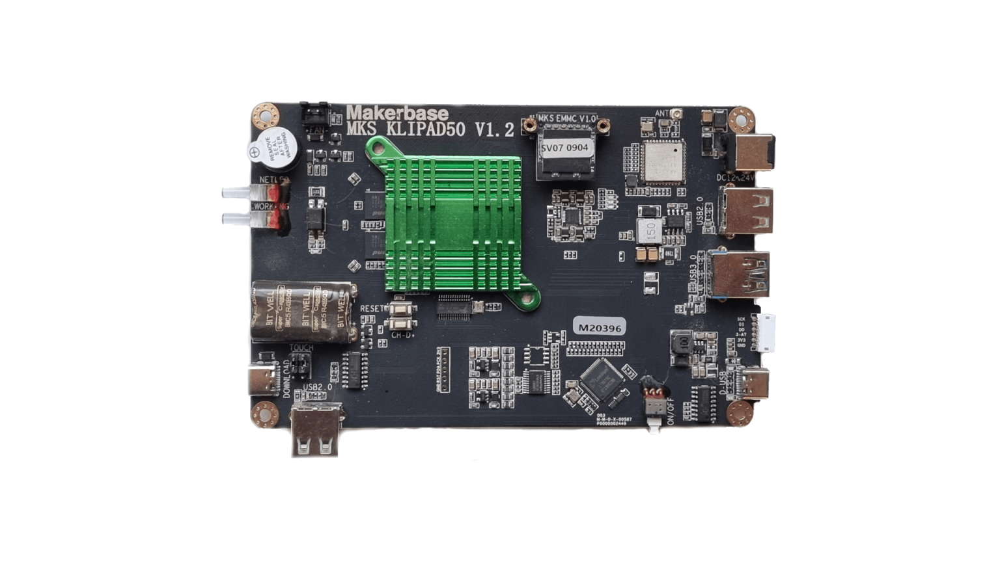

# Hardware
{: .no_toc }
### Contents:
{: .no_toc }
- TOC
{:toc}
----

## MKS-Klipad50

These single board computers are built by Makerbase and sold as Sovol's "KlipperScreen", an addon  for their SV06/SV07 3D-printers that contains a preinstalled Klipper system. The boards are not sold separately and there is absolutely no information about them on either the Makerbase web site or their github repository. In well-known Makerbase tradition, they don't offer any support or information (at least not to end-users).

## Hardware components

<!-- The boards come with a hard-wired 5-inch HDMI-LCD display and touchpanel (via internal USB), external USB-2/3/C ports, an external SPI port (mainly for the included adxl345-spi acceleration sensor), two external LEDs and 802.11b/g Wifi (2.4GHz, 54MB/s max). -->

- 5-Inch HDMI-Display (hardwired, "Designware HDMI", 800x480x32)
- Touchpanel (hardwired, "QinHeng Electronics USB2IIC_CTP_CONTROL", USB-ID 1a86:e5e3, 2048x2048)
- 2 x USB-2, 1 x USB-3, 1 x USB-C
- External SPI port
- WiFi (rtl8723bs or bcm43430, 2.4Ghz, 54MB/s, 802.11b/g)
- 2 status-LEDs ("gpio-leds" via rk805 gpio-controller)
- System on eMMC card
- Internal I2C bus
- 1GB RAM

## Board revisions

There are three revisions of the board (all are supported by the new Armbian images):
- v1.0 
  - WiFi chip: Realtek RTL8723bs
- v1.1
  - WiFi chip: Realtek RTL8723bs
  - Additional fan connector
- v1.2
  - WiFi chip: Broadcom BCM43430
  - Additional fan connector

Pictures of the 1.0 and 1.1 revisions can be found in this [thread](https://forum.sovol3d.com/t/mks-board-inside/3384/13).

## Armbian integration

The Klipad50 boards require the same kernel patches as the MKS-PI/MKS-SKIPR boards, but their devicetree configuration is quite different.

The [MKS-Klipad50](https://www.armbian.com/mks-klipad50) changes are now integrated into mainline Armbian.

The devicetree definitions in the Armbian images have been reverse-engineered from the decompiled dtb of the [original image](https://github.com/Sovol3d/SOVOL_KLIPAD50_SYSTEM) for that board.

See [Armbian images](armbian_images.html) for details how this board is supported.

