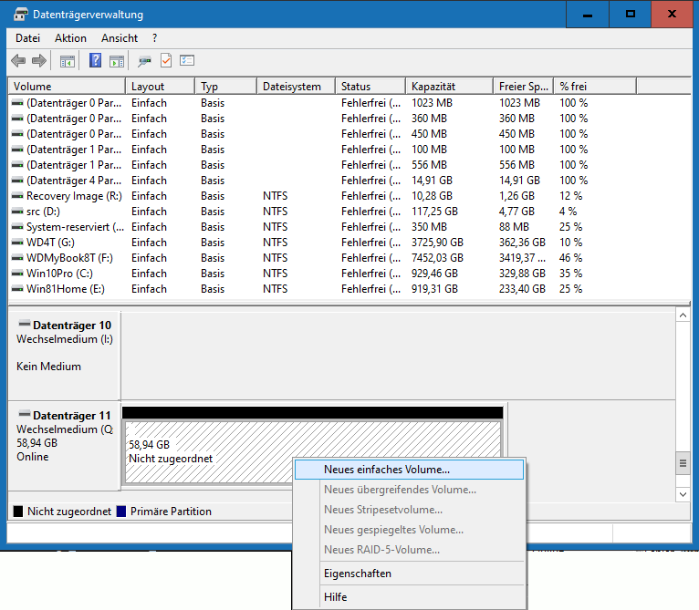

# Updating Klipper
{: .no_toc }
### Contents:
{: .no_toc }
- TOC
{:toc}
----

{: .important-title }
> Tip
>
> If you have trouble following these steps, you may take a look at Vasyl's guide:
> <https://github.com/vasyl83/SV07update?tab=readme-ov-file#12-updating-the-host-mcu-rpi--mcu-firmware>\
> It explains the same steps in a more beginner-friendly way.

## Recompiling Klipper
- First [log in](access.html#ssh-putty) to the device using ssh or putty.
- You need to recompile and install klipper *twice*.  
  Once for the virtual mcu ("mcu-rpi") on the KlipperScreen, and another time for the printer-board ("mcu"), which needs to be flashed via SD-card after that.
- **Compiling klipper for "mcu rpi"** (virtual mcu of the Klipper screen):
```
cd klipper
make menuconfig
```
  - Select "Micro-controller Architecture" and set to "Linux process".
```
make clean ; make ; sudo make flash
```

- **Compiling klipper for "mcu"** (the printer board):
```
cd klipper
make menuconfig
```
  - Change following settings
    * Micro-controller Architecture: STMicroelectronics STM32
    * Processor model: STM32F103
    * Bootloader offset: 28KiB bootloader
    * Communication interface: Serial (on USART1 PA10/PA9)
```
  # make clean ; make
```
  - Copy "out/klipper.bin" to SD-card and rename it (must end in ".bin").  
    !!! Use a different name than that from prior updates (e.g. add some random numbers) !!!  
    (The printer remembers the filename that was used for flashing and won't use it again.)
    - The printer is very picky about the format of the SD-card, make sure to format it with *exactly* these settings:
      - Card size: Smaller than 32GB, but bigger than 2GB (you can create a smaller partition on bigger cards)
      - Filesystem: FAT32 (FAT12/FAT16 also works). *Don't use exFAT or NTFS or anything other!*
      - Sector size: *Must* be set to 4096 (bytes per sector)
      - Better don't have any other files or directories on that card.


## SD-card not accepted
  * Firmware.bin file has to be renamed for each(!) update (\*1)
  * Use a card smaller than 32GB but bigger than 2GB (\*2)
  * Format only as "FAT32" (do NOT use "exFAT" or "NTFS")
  * Set the sector size to 4096
  * Have no other files or directories on that card

\*1: It only gets installed, if the filename differs from the one, which was used for the current installation.  
\*2: Smaller than 2GB does not support 4096byte sectors, larger than 32GB does not support FAT32. If your card is bigger, create a partition which is smaller than 32GB.

Some info about SD-cards taken from [here](https://forum.sovol3d.com/t/sv06-mainboard-brick-after-updating-sovol-firmware/862/68).

## SD-card formatting

{: .note :}
> Use these steps if your card is max. 32GB sized.
> Skip these steps and continue with [Partitioning the SD-card](#partitioning-the-sd-card) for bigger cards.

1. Insert the SD-card to your PC.
1. Open the explorer. Locate the card, click it with the right mouse button and select "Format":\

1. Use *exactly* these settings (FAT32, 4096bytes), others do *not* work.\
   (If there is no "FAT32" option, then the card has the wrong size. It needs to be 2GB to 32GB.)


## Partitioning the SD-card

{: .note :}
> Use these steps only if your card is bigger than 32GB.
> Otherwise use the [SD-card formatting](#sd-card-formatting) steps and continue with [Flashing the printer board ("mcu")](#flashing-the-printer-board-mcu) afterwards.

1. Press \<Windows\>+R key combination, enter "diskmgmt.msc" and press \<Enter\>.

1. Locate the SD-card, right click it in the lower pane and select "delete volume":

1. Right click the lower pane again and select "create new volume":

1. Press "Next" on the welcome screen:

1. Set the volume size to 8192 MB (allowed sizes are 2048 to 32767):

1. Make sure to use a drive-letter that is not in use e.g. by a network drive:

1. Make sure to set sector size to "4096" and filesystem is "FAT32" (other options will not work):

1. Select "next" in the confirmation dialogue:

1. Finally, the new partition will look like this:


## Flashing the printer board ("mcu")

1. After formatting is done, copy the firmware file to the SD-card.\
   *Remember to give it a different name for every(!) flash operation!*

1. Eject the SD-card from the PC.
1. Power down the printer.
1. Insert the SD-card to the printer (directly accessible on SV06/SV06+, on SV07/SV07+ you need to remove the front panel).
1. Power on the printer and wait.
1. If flashing was successful, Klipper will be able to connect to your printer.
1. If Klipper is not able to connect to your printer after ~5 minutes, flashing did not work. Repeat the above steps.
